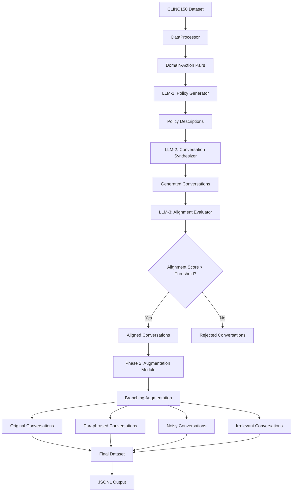

# Arch-Router Dataset Generation Pipeline

> **Inspired by**: [Arch-Router: Aligning LLM Routing with Human Preferences](https://huggingface.co/papers/2506.16655) by Co Tran, Salman Paracha, Adil Hafeez, and Shuguang Chen from Katanemo

A comprehensive dataset generation pipeline for creating conversational training data for LLM routing models. This implementation provides a complete solution for generating, augmenting, and formatting datasets that can be used to train preference-aligned routing models.

## 🎯 Purpose

This repository was created because I loved the ideas presented in the Arch-Router paper but couldn't find any available code for dataset creation. The sole purpose is to provide a robust boilerplate that allows researchers and developers to:

- Generate high-quality conversational datasets for routing models
- Apply various data augmentation techniques (paraphrasing, noise injection, irrelevance)
- Easily customize the pipeline for different use cases


## 🚀 Key Features

- **Multi-LLM Pipeline**: Uses 3 different LLMs for policy generation, conversation synthesis, and alignment evaluation
- **Branching Augmentation**: Each conversation can generate multiple variants (original, paraphrased, noisy, irrelevant)
- **Pydantic Validation**: Robust data validation and parsing using Pydantic models
- **Configurable Pipeline**: Easy to customize through a single configuration file
- **Cost-Effective**: Uses Groq API for cost-effective LLM inference (free trial available)


## 📚 Paper Reference

This implementation is based on the research paper:

**Arch-Router: Aligning LLM Routing with Human Preferences**  
[arXiv:2506.16655](https://huggingface.co/papers/2506.16655) | [Hugging Face Paper](https://huggingface.co/papers/2506.16655)

The paper introduces a preference-aligned routing framework using a compact 1.5B model that effectively matches queries to user-defined domains and action types, outperforming proprietary models in subjective evaluation criteria.

## 🏗️ Architecture



## 📊 Data Source

This pipeline uses **CLINC150** dataset as the source for domain-action pairs. CLINC150 was chosen because:
- It's easily available and widely used in conversational AI research
- Contains diverse intent categories perfect for routing scenarios
- Provides clean, labeled data for policy generation
- You can easily replace it with your own dataset by updating the `DataProcessor` class

## 🛠️ Installation

1. **Clone the repository:**
```bash
git clone https://github.com/samadpls/archdata.git
cd archdata
```

2. **Install dependencies:**
```bash
pip install -r requirements.txt
```

3. **Set up your Groq API key:**
```bash
cp .env.example .env
# Edit .env and add your GROQ_API_KEY
```

4. **Get your Groq API key:**
   - Visit [Groq Console](https://console.groq.com/keys)
   - Create a free account (includes free trial credits)
   - Generate an API key

## 🚀 Quick Start

### Basic Usage

```bash
python main.py
```

### Custom Configuration

```python
from src.config import Config
from src.pipeline import ArchRouterPipeline
import os
from dotenv import load_dotenv

load_dotenv()
api_key = os.getenv("GROQ_API_KEY")

# Customize your pipeline
config = Config(
    target_dataset_size=50,  # Generate 50 samples
    max_conversation_turns=6,
    alignment_threshold=0.85,
    output_file="my_custom_dataset.jsonl"
)

pipeline = ArchRouterPipeline(config, api_key)
dataset = pipeline.run_pipeline()
pipeline.save_dataset(dataset)
```


This project is open source and available under the [MIT License](LICENSE).


> **Note**: This is an independent implementation inspired by the Arch-Router paper. It is not officially affiliated with Katanemo or the original authors.

---

This project was created with ❤️ by [samadpls](https://github.com/samadpls) who was inspired by the excellent work of the Katanemo team. I love the innovative approach they're taking in LLM routing and wanted to contribute to the community by making dataset generation more accessible.