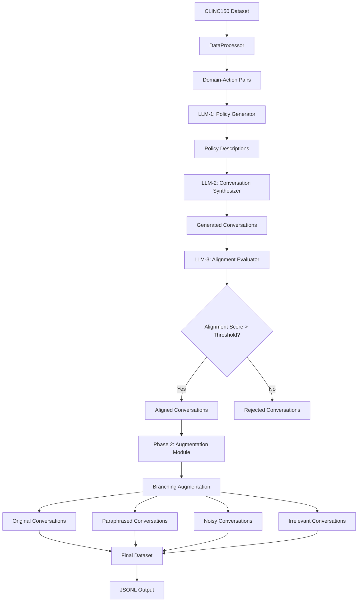

# Architecture Documentation

## 🏗️ Pipeline Overview

The Arch-Router dataset generation pipeline consists of two main phases:

### Phase 1: Data Processing & Policy Generation
1. **DataProcessor**: Extracts domain-action pairs from CLINC150 dataset
2. **LLM-1 (Policy Generator)**: Generates policy descriptions from domain-action pairs
3. **LLM-2 (Conversation Synthesizer)**: Creates conversations following policies
4. **LLM-3 (Alignment Evaluator)**: Scores conversation-policy alignment

### Phase 2: Data Augmentation (Branching Approach)
1. **Selective Paraphrasing**: Modify specific user turns while maintaining meaning
2. **Noise Injection**: Add realistic interruptions and background noise
3. **Irrelevance Generation**: Create negative samples with cross-domain content
4. **Domain Mixing**: Cross-domain conversation mixing for additional negatives

## 🔄 Data Flow



## 📊 Data Source

This pipeline uses **CLINC150** dataset as the source for domain-action pairs. CLINC150 was chosen because:
- It's easily available and widely used in conversational AI research
- Contains diverse intent categories perfect for routing scenarios
- Provides clean, labeled data for policy generation
- You can easily replace it with your own dataset by updating the `DataProcessor` class

## 🔧 Configuration

The pipeline is controlled through a single configuration file (`src/config.py`). Key parameters:

### Dataset Control
- `target_dataset_size`: **Main control parameter** - determines the final dataset size
- `max_samples_per_intent`: Maximum samples per intent from source data
- `max_conversation_turns`: Maximum turns in generated conversations
- `min_conversation_turns`: Minimum turns in generated conversations

### LLM Parameters
- `model_name`: Groq model to use (default: "llama-3.1-8b-instant")
- `alignment_threshold`: Score threshold for conversation-policy alignment (0.0-1.0)
- `use_domain_mixing`: Enable domain mixing for additional negative samples

### Output Control
- `output_file`: Output filename for generated dataset
- `batch_size`: Batch size for processing

## 📊 Output Format

Each generated sample includes:

```json
{
  "conversation": [
    {"role": "user", "content": "I need to book a flight to New York"},
    {"role": "assistant", "content": "I can help you book a flight to New York. When would you like to travel?"}
  ],
  "domain": "travel",
  "action": "book_flight", 
  "description": "Assist users in booking flights.",
  "label_score": 0.95,
  "augmentation_type": "original"
}
```

## 🔄 Augmentation Types

The pipeline supports four types of data augmentation:

1. **Original**: Clean, unmodified conversations (40-50%)
2. **Paraphrase**: User turns paraphrased while maintaining meaning (30-40%)
3. **Noise**: Realistic interruptions and background noise added (20-25%)
4. **Irrelevant**: Cross-domain or completely irrelevant conversations (10-15%)

## 🎨 Customization

### Adding New Augmentation Types

1. Create a new method in `AugmentationModule`
2. Add the augmentation type to the branching logic
3. Update the prompt templates if needed

### Modifying the Pipeline Flow

1. Edit `src/pipeline.py` to add new steps
2. Update the configuration in `src/config.py`
3. Add corresponding tests

### Using Different LLM Providers

1. Create new LLM wrapper classes
2. Update the pipeline to use your preferred provider
3. Modify the configuration accordingly

## 💡 Why Groq?

The choice of Groq API was made for cost-effectiveness reasons:

- **Free Trial**: Generous free trial credits for experimentation
- **Fast Inference**: High-speed LLM inference
- **Cost-Effective**: Competitive pricing for production use
- **Reliability**: Stable API with good documentation

The paper didn't specify the exact models used for dataset creation, so Groq provides a practical and accessible alternative.
